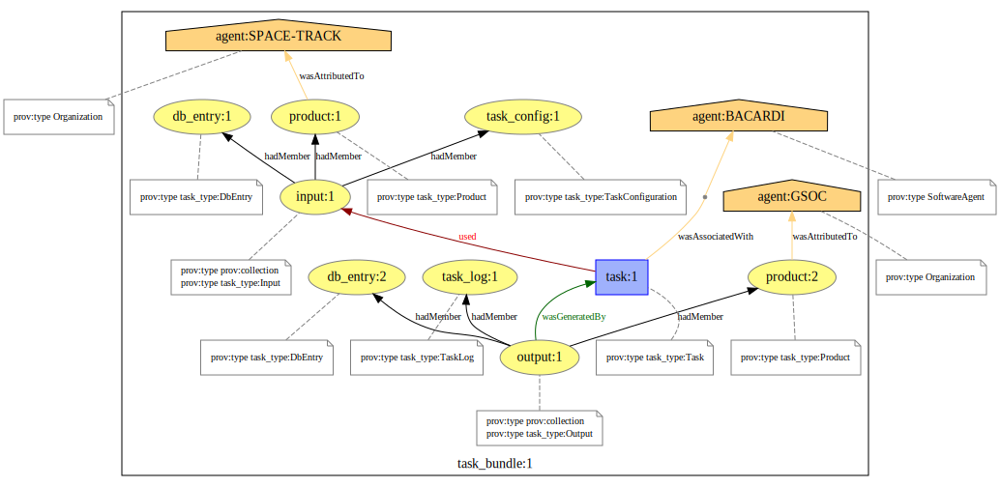
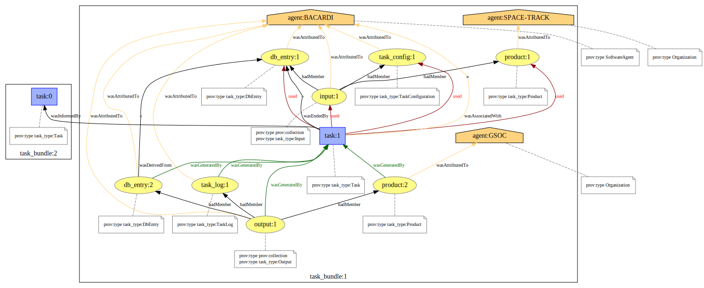
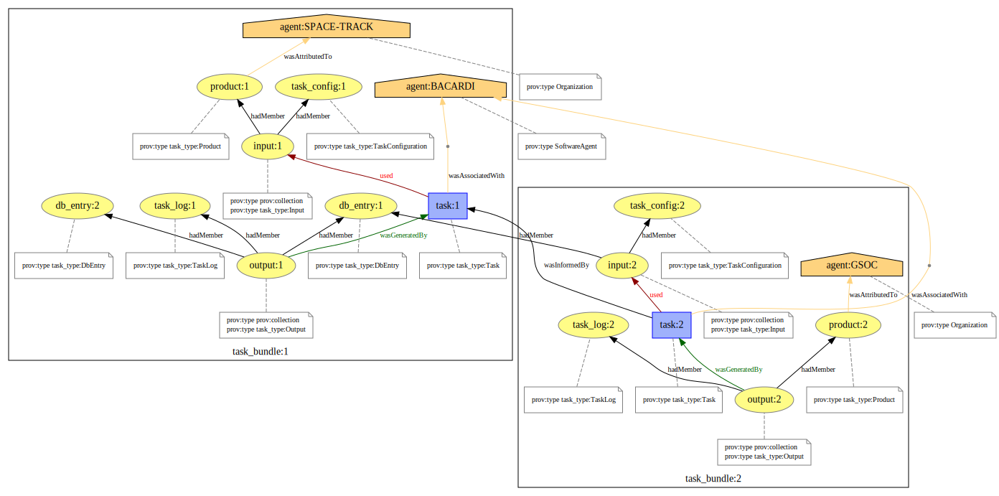

<!--
SPDX-FileCopyrightText: 2023 German Aerospace Center (DLR)
SPDX-License-Identifier: CC-BY-SA-4.0
-->

# Task Model

The task model specifies how provenance of a task in BACARDI must be recorded according to the W3C PROV standard.

## Task Namespaces

The task namespaces provide qualified names for types, roles and attributes used in the BACARDI task model.

|    Name   |  Prefix |     full-qualified URL       |
| --------- | ------------------- | -------------- |
|   Task Type    | task_type |   https://bacardi.dlr.de/prov/ns/task/type/#    |
|   Roles        | task_role |   https://bacardi.dlr.de/prov/ns/task/role/#    |
|   Attributes   | task_attr | https://bacardi.dlr.de/prov/ns/task/attribute/# |


In addition, the namespace defines resource locations to build stable resource identifiers for entities, activities and agents.
The `ID` represents the unique record identifier and shall be replaced by a stable and well-defined id such as `uuid`.

| Resource | Identifier Prefix | URI | Description |
|------|------|-----|-------------|
| Agent | agent:ID | https://bacardi.dlr.de/prov/Agent/| Resource location for agents |
| TaskBundle | task_bundle:ID | https://bacardi.dlr.de/prov/entity/TaskBundle/ | Resource location for task bundle entities |
| Task | task:ID | https://bacardi.dlr.de/prov/activity/Task | Resource location for task activities |
| TaskConfiguration | task_config:ID | https://bacardi.dlr.de/prov/entity/TaskConfiguration/ | Resource location for task configuration entities |
| TaskLog | task_log:ID | https://bacardi.dlr.de/prov/entity/TaskLog/ | Resource location for task log entities |
| Input | input:ID | https://bacardi.dlr.de/prov/entity/Input/ | Resource location for input collections entities |
| Output | output:ID | https://bacardi.dlr.de/prov/entity/Output/ | Resource location for output collections entities |
| DbEntry | db_entry:ID | https://bacardi.dlr.de/prov/entity/DbEntry/ | Resource location for Database entry entities |
| Product | product:ID | https://bacardi.dlr.de/prov/entity/Product/ | Resource location for product entities |


## Task PROV Types

The task model defines its own set of qualified names to identify types of entities and activities.
Types use the prefix `task_type` and are values to the `prov:type` attribute. 
The following list gives an overview of the defined types.

| Type | Concept | Description |
|------|---------|-------------|
| Task | Activity | A computational task executed by the system |
| TaskBundle | Bundle | A named set of provenance descriptions directly related to task activity |
| TaskConfiguration | Entity | The configuration used in an executed task |
| TaskLog | Entity | Additional meta information logged during the task run |
| Input | Collection | A collection of all inputs used by a task |
| Output | Collection | A collection of all inputs generated by a task |
| DbEntry | Entity | A database entry that was used or generated by a task |
| Product | Entity | A final data product used or generated by a task | 

### Task
A task is a program step executed by the BACARDI system.
It must have a label indicating the task name.

Required attributes:

| Attribute| Value | DataType |
| -------- | ----- | -------- |
| prov:type | task_type:Task | |

PROVN Example:
```provn
activity(task:1, [prov:type='task_type:Task'])
```

### TaskBundle
The `TaskBundle` can be used to represent all provenance related to a single task activity as a single 
entity. This entity can be used to track task provenance in a higher level provenance model, such as a workflow model.

Required attributes:

| Attribute| Value | DataType |
| -------- | ----- | -------- |
| prov:type | prov:Bundle ||
| prov:type | task_type:TaskBundle ||


PROVN Example:
```provn
entity(task_bundle:1, [prov:type='task_type:TaskBundle'])
```

### TaskConfiguration
The `TaskConfiguration` holds all parameters and arguments that where passed to the task.


Required attributes:

| Attribute| Value | DataType |
| -------- | ----- | -------- |
| prov:type | task_type:TaskConfiguration ||


PROVN Example:
```provn
entity(task_config:1, [prov:type='task_type:TaskConfiguration'])
```

### TaskLog
The `TaskLog` provides additional meta information about the task run.

Required attributes:

| Attribute| Value | DataType |
| -------- | ----- | -------- |
| prov:type | task_type:TaskLog ||


PROVN Example:
```provn
entity(task_log:1, [prov:type='task_type:TaskLog'])
```


### Input
The `Input` collection collects all entities that were used as input to the activity. 

Required attributes:

| Attribute| Value | DataType |
| -------- | ----- | -------- |
| prov:type | prov:Collection **OR** prov:EmptyCollection | |
| prov:type | task_type:Input | |

PROVN Example:
```provn
entity(input:1, [prov:type='prov:Collection',
                 prov:type='task_type:Input'])
```


### Output
The `Output` collection collects all entities that were output by the activity. 

Required attributes:

| Attribute| Value | DataType |
| -------- | ----- | -------- |
| prov:type | prov:Collection **OR** prov:EmptyCollection | |
| prov:type | task_type:Output | |

PROVN Example:
```provn
entity(output:1, [prov:type='prov:Collection',
                  prov:type='task_type:Output'])
```

### DbEntry
The `DBEntry` type represents a single entry to a generalized database model.
The type is used for all internal data that was used or generated in a task.

Required attributes:

| Attribute| Value | DataType |
| -------- | ----- | -------- |
| prov:type | task_type:DbEntry | |
| task_attr:DbModel | "MODELNAME" | xsd:string |
| prov:location | "Location of the Database Entry" | |

PROVN Example:
```provn
entity(db_entry:1, [prov:type='task_type:DbEntry',
                    task_attr:DbModel='Tle',
                    prov:location='1'])
```


### Product 
The `Product` type represents a data product that was used or generated in a task.
A product is defined as data with a well-defined data format that was exported or imported by a task  
A product used in a task is usually associated to a different agent than the task itself.

Required attributes:

| Attribute| Value | DataType |
| -------- | ----- | -------- |
| prov:type | task_type:Product | |
| task_attr:DataFormat | "DATAFORMAT" | xsd:string |


PROVN Example:
```provn
entity(product:1, [prov:type='task_type:Product',
                   prov:location='http:example.org/product_1.json'
                   task_attr:DataFormat='JSON'])
```

## Required Task PROV Model Relations 

The following PROV relations are **required** within the task model.

| PROV Relation    |         Type 1        |             Type 2              |
| ---------------- | --------------------- | ------------------------------- |
| wasGenerated     | task_type:Output      | task_type:Task                  |
| used             | task_type:Input       | task_type:Task                  |
| hadMember        | task_type:Input       | task_type:DbEntry               |
| hadMember        | task_type:Input       | task_type:Product               |
| hadMember        | task_type:Input       | task_type:TaskConfiguration     |
| hadMember        | task_type:Output      | task_type:DbEntry               |
| hadMember        | task_type:Output      | task_type:Product               |
| hadMember        | task_type:Output      | task_type:TaskLog               |
| wasAssociatedWith| task_type:Task        | prov:Agent                      |
| wasAttributedTo  | task_type:Input       | prov:Agent                      |
| wasAttributedTo  | task_type:Output      | prov:Agent                      |
| wasAttributedTo  | task_type:Product     | prov:Agent                      |
| wasAttributedTo  | task_type:DbEntry     | prov:Agent                      |
| wasAttributedTo  | task_type:TaskLog     | prov:Agent                      |
| wasAttributedTo  | task_type:TaskConfiguration | prov:Agent                |


## Optional Task PROV Model Relations

The following PROV relations are **optional** within the task model.

| PROV Relation    |         Type 1        |             Type 2              |
| ---------------- | --------------------- | ------------------------------- |
| wasGenerated     | task_type:DbEntry      | task_type:Task                  |
| wasGenerated     | task_type:Product      | task_type:Task                  |
| wasGenerated     | task_type:TaskLog      | task_type:Task                  |
| used             | task_type:DbEntry      | task_type:Task                  |
| used             | task_type:Product      | task_type:Task                  |
| used             | task_type:TaskConfiguration      | task_type:Task        |
| wasInformedBy    | task_type:Task         | task_type:Task                  |
| wasDerivedFrom   | task_type:DbEntry      | task_type:DbEntry               |
| wasEndedBy       | task_type:Task         | task_type:DbEntry               |


# Graphical representations

## Task Model



## Extended Task Model



## Multiple Bundle Example


